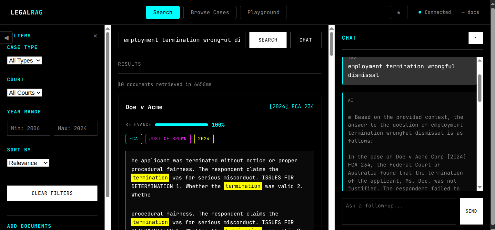

# FastAPI RAG Engine

A high-performance Retrieval-Augmented Generation (RAG) backend featuring semantic search, cross-encoder reranking, and live PDF/XML ingestion. Built with FastAPI and local vector search.

## Features

- **Search-First Design** - Collapsible sidebars: filters (left) | docs (center) | chat (right)
- **Case Browsing** - Browse all indexed cases with pagination
- **Metadata Filters** - Filter by court, judge, year range, case type
- **Relevance Score** - Color-coded percentage (green/yellow/red) showing document relevance
- **Case Cards** - Document display with citation, court, judge, year badges
- **Full Case View** - Modal with complete document text
- **AI Chat** - Right sidebar for AI answers (triggered by search or "Ask AI" per case)
- **Snippet Highlighting** - Relevant passages with keyword marks
- **PDF & Text Upload** - Auto-parse, chunk, embed, and index
- **Keyboard Shortcuts** - `/` search, `s` search, `b` browse, `c` chat, `?` help

## Tech Stack

- **Backend:** FastAPI, Python 3.11+
- **Vector DB:** Zvec (local)
- **Embeddings:** BAAI/bge-small-en-v1.5 (384 dimensions)
- **Reranking:** cross-encoder/ms-marco-MiniLM-L-6-v2
- **LLMs:** Cerebras (primary), Gemini, OpenRouter (fallback)
- **PDF Processing:** PyMuPDF

## Quick Start

### 1. Install Dependencies

```bash
uv sync
```

### 2. Configure Environment

```bash
cp .env.example .env
# Add your API keys to .env
```

Required: at least one of `CEREBRAS_API_KEY`, `GEMINI_API_KEY`, or `OPENROUTER_API_KEY`

### 3. Sync Knowledge Base

```bash
cd src
uv run python -m pdf_ingest --generate-test-pdfs
uv run python sync_knowledge_base.py
```

### 4. Run API Server

```bash
cd src
uv run uvicorn api_server:app --reload --port 8000
```

### 5. Open Demo

Visit http://localhost:8000/demo

## Demo Interface



### Layout
```
[Filters ◀] | [Search + Results] | [Chat ▶]
```

- **Left sidebar** (collapsible): Filters for court, case type, year range
- **Center**: Search bar + case cards with relevance scores + snippets
- **Right sidebar** (collapsible): AI chat, opens automatically when searching

### Tabs
- **Search** - Semantic search with metadata filters
- **Browse Cases** - Grid view of all indexed cases
- **Playground** - Configure prompts and generation settings

### Keyboard Shortcuts
| Key | Action |
|-----|--------|
| `/` | Focus search |
| `s` | Search tab |
| `b` | Browse tab |
| `c` | Toggle chat |
| `?` | Show help |
| `Esc` | Close modal |

## API Endpoints

### Filter Options
```bash
curl http://localhost:8000/api/filters
```

### List Cases
```bash
curl "http://localhost:8000/api/cases?limit=10&offset=0"
```

### Get Case Detail
```bash
curl "http://localhost:8000/api/cases/contract_case_001.pdf"
```

### Search with Filters
```bash
curl -X POST http://localhost:8000/api/search \
  -H "Content-Type: application/json" \
  -d '{"query": "contract damages", "top_k": 5, "filters": {"court": "High Court"}}'
```

### Chat (streaming)
```bash
curl -N -X POST http://localhost:8000/api/chat \
  -H "Content-Type: application/json" \
  -d '{"question": "What did the court decide?"}'
```

### Upload Document
```bash
curl -X POST http://localhost:8000/api/upload -F "file=@case.pdf"
```

### Health Check
```bash
curl http://localhost:8000/api/health
```

## Configuration

Set in `.env`:

| Variable | Default | Description |
|----------|---------|-------------|
| `RAG_ENABLE_RERANKING` | true | Enable cross-encoder reranking |
| `RAG_TOP_K` | 5 | Results to retrieve |
| `LLM_PROVIDER` | cerebras | cerebras, gemini, openrouter |

## Project Structure

```
legal-rag/
├── src/
│   ├── api_server.py          # FastAPI application
│   ├── rag_pipeline.py       # RAG orchestration
│   ├── pdf_ingest.py         # PDF + TXT parsing
│   ├── reranker.py           # Cross-encoder reranking
│   ├── snippet_extractor.py  # Snippet highlighting
│   ├── sync_knowledge_base.py  # Batch ingestion
│   ├── config.py             # Configuration
│   ├── llm_client.py         # LLM client
│   ├── embedding_client.py   # Embeddings
│   └── vector_store.py       # Zvec backend
├── static/
│   └── demo.html             # Demo interface
├── data/
│   └── legal-docs/           # PDF & TXT documents
├── docs/
│   └── plans/                # Implementation plans
├── pyproject.toml             # UV package config
└── .env.example               # Environment template
```

## License

MIT
